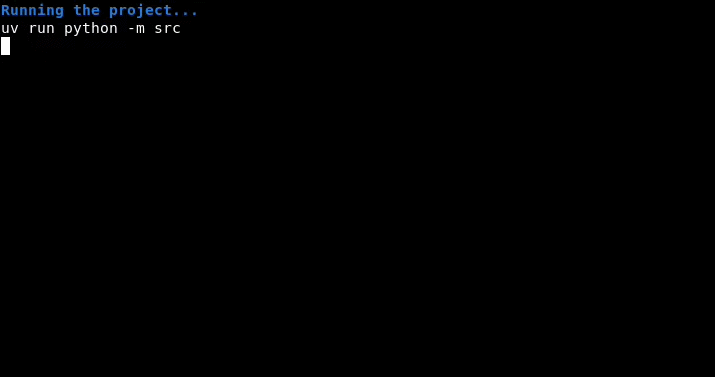
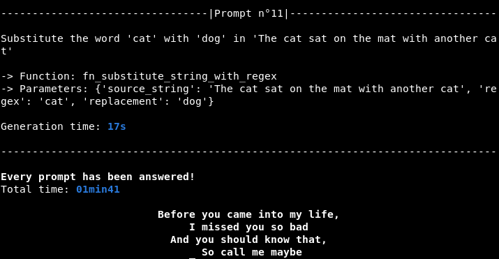
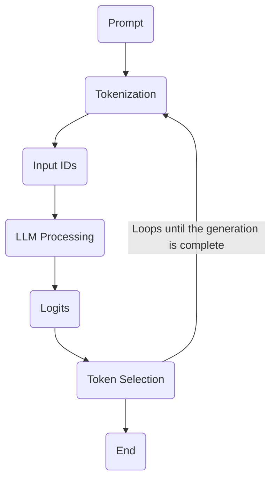
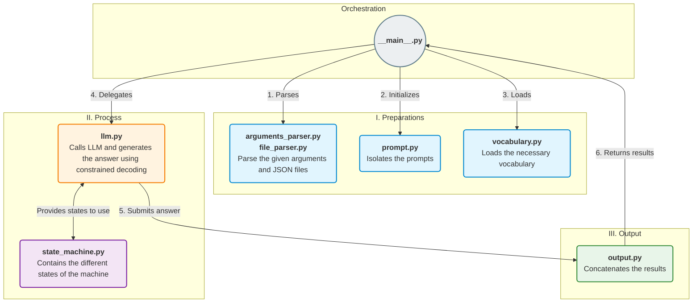

<div align="center">
    <i>This project has been created as part of the 42 curriculum by npillet</i>
    <h1>Call Me Maybe</h1>
    <h3>Introduction to function calling in LLMs</h3>
</div>


## Description
A **Large Language Models** (**LLM**) is a type of AI program that is capable of generating text. They are trained on large databases and generate their answers to the user prompt using this knowledge.

For this project, we will build a function calling program.<br>
It will reunite the name of the function needed to answer the prompt and extract the parameters from it to put it inside a valid JSON file.

The challenge here will be the use of a small language model (0.6B). These models are notoriously unreliable at generating a structure output, they succeed about 30% of the time to generate a valid JSON.<br>
Our objective is to have a +99% reliability with that same kind of model.<br>
We can achieve this with **constrained decoding**. It is a technique that guides the model's output token-by-token to guarantee a valid structure, without relying solely on prompting.


## Instructions
With these commands, once entered inside the terminal, the program will be able to run.
``` bash
make # Runs the program after installing the necessary dependencies

uv run python -m src # Runs the program with the default parameters
```

If you want to specify the files, use the template below:
```bash
uv run python -m src [--functions_definition <path_to_function_definition_file>] [--input <path_to_input_file>] [--output <path_to_output_file>]
```

**The flags:**
| Flags | Explanation |
| --- | --- |
| `--functions_definition` or `-f` | Adds the path to the function definition file |
| `--input` or `-i` | Adds the path to the prompt file |
| `--output` or `-o` | Adds the path to the prompt answers file |

Here is the same template with the default parameters:
``` bash
uv run python -m src --functions_definition data/input/functions_definition.json --input data/input/function_calling_tests.json --output data/output/function_calling_results.json
```

### Example Usage
After running one of the commands from the instruction section above, the program will display this:


It will then go through every prompt inside the `function_calling_test.json` that is presented like below:
```json
  {
    "prompt": "What is the sum of 2 and 3?"
  }
```

The program finds the best matching function defined in `functions_definition.json` and completes the missing parameters.<br>
The program can handle a few types of parameters such as:
- `string`
- `number`
- `integer`
- `bool`

After every prompt, the time taken to generate the function and its parameters is displayed. Once the program went through every prompt, it displays the total time taken for the generation.


The complete answer is then written in `function_calling_results.json`, the output file:
```json
    {
        "prompt": "What is the sum of 2 and 3?",
        "name": "fn_add_numbers",
        "parameters": "{'a': 2.0, 'b': 3.0}"
    }
```


## Algorithm Exlpanation
To better understand the algorithm, we will first see what the generation pipeline is.
Below is a schematized version of the process:


### Constrained Decoding
Language Models generate text token by token. After each, the model assigns a probability on every possible next token. That's the *logits*. You then choose the next token from this list or pick the one with the highest probability.<br>
**Constrained decoding** modifies those logits before selecting the next token.

My application of this was setting every token I didn't want at `-inf` using `numpy`. After this, I select the best token, clean it and add it to the output string.

### State-Machine
I also decided to use a State Machine for the generation of the function name and the parameters.<br>
It is composed of five states:
| State | Explanation |
| --- | --- |
| FUNCTION | When searching the function's token |
| PARAMETER | When searching the parameters' token |
| INCOMPLETE_PARAMETER | When searching for the parameters' token when there are multiple parameters |
| DECODE | When decoding the previous token |
| FINAL | When either the function or parameters are found |

### Other Precautions
Once the function is found, the program pre-selects the arguments, when possible, and chooses the best matching argument to the researched parameter.

### Project's Architecture


## Design Decisions
I used a **State-Machine** because, at the beginning, it seemed not too difficult to implement and it was a notion I didn't explore yet. On top of that, it made the search easier depending on what the llm needed, as the function search and parameters search are a bit different.

I pre-selected the parameters that can be found inside the prompt to find them more accurately and reduce the generation time.

I chose to generate only the function and the parameters' name and values instead of generating the entire JSON file so the generation time is reduced and I avoid formatting-related issues.


## Performance Analysis
### Accuracy
When processing the eleven original prompts, the program was able to:
- finds 11 functions accurately
- finds 10 sets of parameters in the correct order

### Speed
The expected time required to generate all eleven answers to the prompts shouldn't be above 5 minutes. At the end of the program, around 1 minute and 40 seconds are taken.<br>
Each prompt can take between 5 and 20 seconds. It depends on the length of what is generated. For instance, the `fn_greet`  function is quicker to generate than the `fn_substitute_string_with_regex` function.<br>
Something else that inflences the generation time is the number of parameters to find.

### Reliability
Generally, the llm could find the functions of other prompts pretty accurately. However, it has more difficulties finding parameters, especially in the correct order.


## Challenges Faced
During this project, I faced a few difficulties.<br>

Correctly finding the desired function, mostly with `fn_substitute_string_with_regex`. 
- I managed to solve the problem by modifying the prompt given to the llm.

Find and complete every parameter of a function when it has more than one.
- I had an initial idea of what caused the problem and tried implementing it.<br>
It still didn't work then and therefore I asked Claude for assistance. A clearer way to put it in place provided but still caused a few issues.<br> Then a new state was created to make it properly work. 

Correctly find the parameters and put them in the right order.
- I found how to almost completely solve the issue by modifying the prompt given to the llm.


## Testing Strategy
The first test was finding the functions of the **original prompts** to see if the program was correctly working. <br>

After this, messing with the **JSON files** to verify the parsing was correctly implemented.<br>

Finally, **edge case**'s prompt and new functions were given to see what the llm output would be. The edge cases consisted of:
- empty prompt
- space-filled prompt
- prompt with no answer

Overall, the llm reacts well to every test and a few modications were made to accommodate some cases like the empty prompt.


## Resources
### Notions:
#### Parsing
- https://docs.python.org/3/library/argparse.html

#### JSON Files
- https://docs.python.org/3/library/json.html#encoders-and-decoders

#### AI Model
- https://huggingface.co/Qwen/Qwen3-0.6B

#### LLM State-Machine
- https://github.com/MLConvexAI/LLM-State-Machine

#### REGEX
- https://medium.com/@victoriousjvictor/understanding-regular-expressions-regex-e1c048f5aa6c

### GitHub:
- [Overtekk](https://github.com/Overtekk/Call_Me_Maybe)

- [Flipsbone](https://github.com/Flipsbone/Call-Me-Maybe-42)

- [naha7777](https://github.com/naha7777/Call_Me_Maybe)

- [fcaval42](https://github.com/fcaval42/CallMeMaybe)

- [saeedehAsheri](https://github.com/saeedehAsheri/CallMeMaybe)

### AI Usage:
During this project, AI was used to correctly put in place a way to find more than one parameter.
